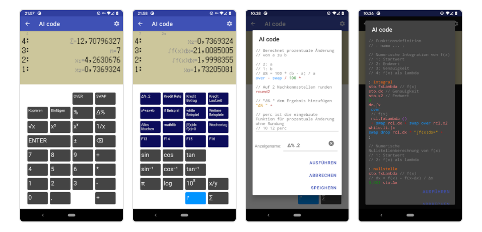

AIcode
================

Introduction
------------

AI code is a programmable calculator for Android.
It is also available within the [StockRoom App](https://github.com/jurgen178/StockRoom) to support financial calculations.

AI code supports Forth-style definitions, variables and lamda expressions. As an engineer, I have been using a HP calculator since University and this is how I imagine a modern programmable calculator. The app comes preloaded with lots of example code to try out.
Use *:clearcode* to remove all examples, and *:defaultcode* to restore all examples.




Example scripts to calculate the integral and zero points of functions:  

```
import."mathlib"

// Math calculus examples

// Store the function in a variable 'fx1' .
// -e^(x-2)
{ 2 - e swap ^ -1 * } sto.fx1

// Integral
0    // start
2    // end
0,001    // precision
rcl.fx1  // f(x) as lambda
integral

// Zero point, uses the function inline.
-3    // start
{ sto.x rcl.x dup dup * * rcl.x dup * + rcl.x 4 * - 4 - }    // x^3+x^2-4x-4
nullstelle
```

Example code Vector/Matrix operations and statistics:  

```
// Vector, Matrix in variable
[ 1 2 3 ] "Vector " +
sto.v1
[ [ 3 2 1 ]
  [ 1 0 2 ] ] "Matrix " +
sto.m1

rcl.v1
rcl.m1

// Matrix multiplication
[ [ 1 2 ]
  [ 0 1 ]
  [ 4 0 ] ]

[ [ 3 2 1 ]
  [ 1 0 4 ] ]

*

// solve system of equations
[ [ 1 2 3 ]
[ 1 1 1 ]
[ 3 3 1 ] ]

[ 2 2 0 ]

solve

// Matrix invert
[ [ 1 2 0 ]
  [ 2 4 1 ]
  [ 2 1 0 ] ] 

inv
```
